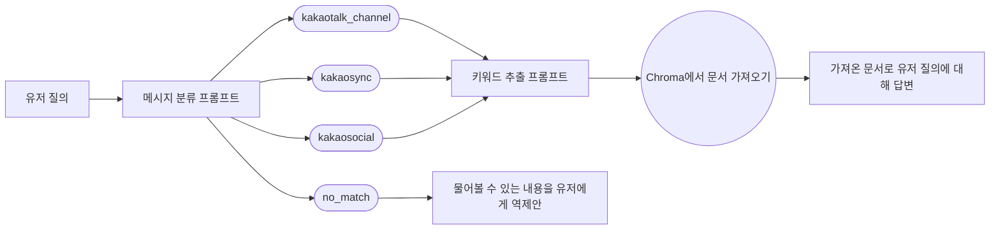

# 프로젝트 3단계

카카오톡 채널, 카카오 싱크, 그리고 카카오 소셜에 대해 안내하는 챗봇입니다.

LangChain과 Chroma를 활용하여 작성되었습니다.

이 챗봇 스킬 서버는 **mario.h**의 스켈레톤 코드를 기반으로 작성되었습니다.

## 실행 방법

### (1) 콜백 서버 실행하기

1. (필수 아님) `venv` 또는 `virtualenv`로 파이썬 가상 환경을 활성화합니다.
2. `pip3 install -r requirements.txt`로 필요한 라이브러리를 설치합니다.
3. `export OPENAI_API_KEY=...`로 OpenAI API 키를 등록합니다.
4. `uvicorn main:app --host 0.0.0.0`과 같은 명령어로 서버를 띄웁니다. (당연히 다른 ASGI 서버로도 가능합니다)

### (2) 챗봇 생성하기

1. <https://chatbot.kakao.com/>에서 채널을 만들고 챗봇을 만듭니다.
2. 챗봇 관리자 센터에서 스킬을 생성하고, 콜백 URL을 위 **(1) 콜백 서버 실행하기**에서 띄운 서버의 콜백 엔드포인트를 향하게 합니다.
3. 이제 시나리오 메뉴에서 원하는 시나리오에 해당 스킬을 추가하면 됩니다.
4. AI 챗봇의 경우 5초를 넘으면 타임아웃이 발생하기 때문에, 설정 메뉴의 AI 챗봇 관리 탭에서 AI 챗봇 설정 활성화가 필요합니다.
5. AI 챗봇 설정이 활성화되면 시나리오의 Callback 설정에서 타임아웃을 연장할 수 있습니다.

### (3) 테스트하기

1. 카카오톡을 실행하고, **(2) 챗봇 생성하기**에서 만든 채널을 추가합니다.
2. 채널 채팅방에 메시지를 보내 정상적으로 응답이 오는 것을 확인합니다.

## 실행 과정

1. `main.py`가 실행됨과 동시에 Chroma DB에 미리 작성해둔 문서 조각들이 저장됩니다.
2. 챗봇 콜백을 받으면 `callback.py`의 `complete_user_utterance()`를 통해 유저 질의에 대한 답변을 생성합니다.
   답변 생성 과정은 아래의 **LangChain 구성** 절을 참고 부탁드립니다.

## LangChain 구성

LangChain 파이프라인은 `Runnable`을 구현하여 이어 붙이는 식으로 구성되어 있습니다.

각 `Runnable`의 구현체는 `tasks.py`에서 확인할 수 있습니다.

파이프라인 연결은 `callback.py`의 `complete_user_utterance()`에서 확인할 수 있습니다.

